## SecurityContextHolder와 Authentication

### SecurityContextHolder

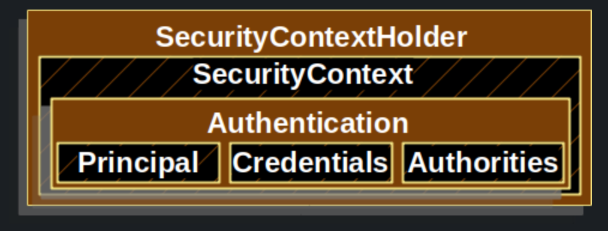

`SecurityContext` 를 제공. 기본적으로 `ThreadLocal`을 사용하기 때문에 `SecurityContext`는 동일 쓰레드 내에서 **항상 접근이 가능**

### SecurityContext

`Authentication`을 제공

```java
// SecurityContextHolder -> SecurityContext -> Authentication
Authentication authentication = SecurityContextHolder.getContext().getAuthentication();

// Principal
Object principal = authentication.getPrincipal();
// GrantedAuthority의 리스트 (한 사용자는 여러 권한을 가질 수 있기 때문)
Collection<? extends GrantedAuthority> authorities = authentication.getAuthorities();
// Credentials - 인증 정보 (인증 후엔 null)
Object credentials = authentication.getCredentials();
// 인증 여부
boolean authenticated = authentication.isAuthenticated();
```

### Authentication

사용자의 인증 정보를 저장하는 토큰의 개념 (인터페이스). 사용자 별로 별개의 `Authentication`이 생성된다. 내부에 크게 2가지 정보 - `Principal`과`GrantAuthority`를 저장한다. Form 인증 방식에서는 `UsernamePasswordAuthenticationToken`이 구현체로 사용된다.

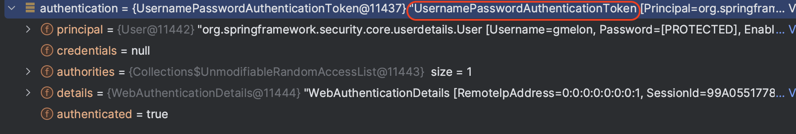

사용자 별 `Authentication`객체를 구분하는 방법으로, `SecurityContextHolder`가 `ThreadLocal`에 저장되기 때문에 각각의 쓰레드 별로 `SecurityContextHolder` 를 가질 수 있다. (기본 모드인 `MODE_THREADLOCAL`에서는 다른 쓰레드에서는 접근 불가)

`SecurityContextHolder` 에는 반드시 인증이 된 객체가 들어가게 되어있음. 따라서, `isAuthenticated()` 메서드는 로그아웃 전까지는 항상 `true`를 반환할 것임. (다만, OAuth 방식 등의 경우 토근이 만료되면 `false` 반환)

#### Principal

인증된 사용자가 **누구** 인지에 해당하는 정보로 `Principal` 자체는 인터페이스이며 `UserDetailsService`에서 반환하는 `UserDetails`  인터페이스의 객체가 주로 구현체로 사용됨

#### UserDetails

유저 정보를 담는 인터페이스로, `User` 클래스가 구현하고 있음. `Principal`에 실제로 담기는 객체는 `User` 객체.

>   사용자가 구현한 `유저 Entity`와 시큐리티 상의 `유저 정보`와의 어뎁터 역할을 수행함

#### GrantAuthority

`ROLE_USER` , `ROLE_ADMIN` 등 Principal이 가지고 있는 **권한**을 나타낸다. 인증 이후, **인가** 과정에서 사용되는 정보

#### UserDetailsService

DB, 메모리, ... 등 어디든지에 저장되어 있는 **유저**의 정보를 `UserDetails` 타입으로 가져오는 DAO 인터페이스. 얘를 `implements` 하여 repository에서 유저 정보를 가져와 `UserDetails` 타입으로 반환해주면, 해당 정보를 통한 **실제 인증**은  `AuthenticationManager` 가 수행한다.

## AuthenticationManager와 Authentication

실제로 `Authentication`을 만들고 인증을 처리하는 곳이 바로 `AuthenticationManager`이다. `SecurityContextHolder`는 단순히 인증된 `Authentication` 객체를 들고만 있는다. 

### AuthenticationManager

인터페이스. 오직 하나의 메서드만을 API로 갖는다.

```java
Authentication authenticate(Authentication authentication) throws AuthenticationException;
```

로그인을 시도한 유저의 `username`, `password` 를 담고 있는 `Authentication`(Form 인증의 경우 `UsernamePasswordAuthenticationToken`)을 받아서 **인증을 수행**하고 인증에 성공한다면, 인증된 정보가 들어있는 `Authentication`을 반환해준다. 만약 실패한다면 상황에 맞는 예외를 던진다.

### ProviderManager

`AuthenticationManager`의 **기본 구현체**. 여러가지 `AuthenticationProvider`를 사용해 인증을 처리한다.  자신이 가지고 있는 `AuthenticationProvider`를 통해 인증이 불가능하면, 상위의 `ProviderManager`에게 반복적으로 인증 처리를 위임하는 구조로 되어있다.

### AuthenticationProvider

`Authentication`의 구현체에 따라 인증을 처리할 수 있는 `Provider` 구현체가 다르다. `AuthenticationProvider`는 이러한 `Provider`들에 대한 인터페이스를 제공한다.

*   `Authentication authenticate(Authentication authentication)` - 인증 처리 로직
*   `boolean supports(Class<?> authentication)` - 해당 Provider가 인자로 넘어온 `authentication`에 대해 인증을 처리할 수 있는지 여부를 반환

### 디버그를 통해 인증 과정 살펴보기

먼저 아래와 같이 `ProviderManager`의 `authenticate()` 메서드에 디버그를 건다.

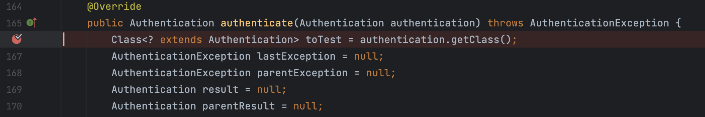

아래와 같이 계정을 생성하고 로그인을 시도한다.

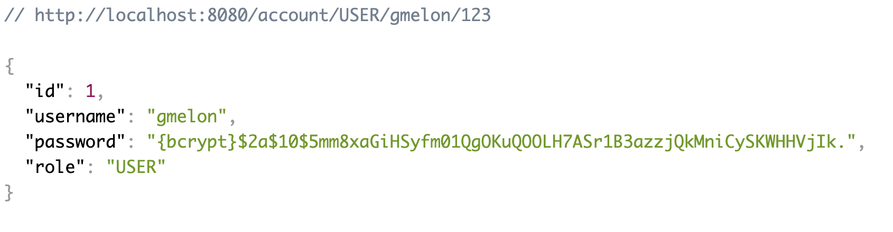

그럼 먼저 아래처럼 입력한 `username`, `password`를 가지고 있는 `UsernamePasswordAuthenticationToken`이 `ProviderManager`의 `authenticate()` 메서드로 전달된다.

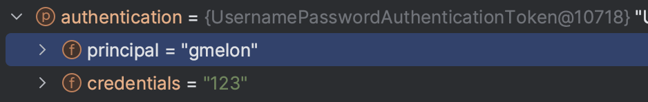

이어서 `ProviderManager`는 자신이 가지고 있는 `AuthenticationProvider`를 순회하면서 인자로 들어온 `Authentication`을 처리할 수 있는 `AuthenticationProvider`를 찾는다.

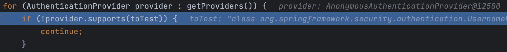

최초로 걸리는 `Provider`인 `AnnonymousAuthenticationProvider`는 Form 인증에서 사용되는 `UsernamePasswordAuthenticationToken` 은 처리하지 못한다. 따라서 아래 로직에 의해 자신의 `parent` Provider에게 다시 인증을 요청한다.


다음으로 걸리는 Provider인 `DaoAuthenticationProvider`는 `UsernamePasswordAuthenticationToken` 을 처리할 수 있다.

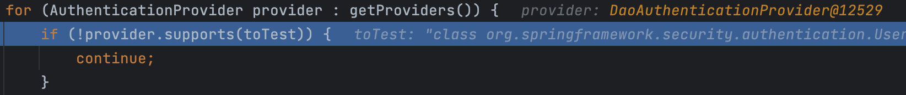

따라서 이제 실제 provider에게 인증을 요청한다.


provider의 `authentication()` 메서드는 몇 가지 검증, 값 대입을 수행한 후 `retriveUser()` 메서드를 호출한다.

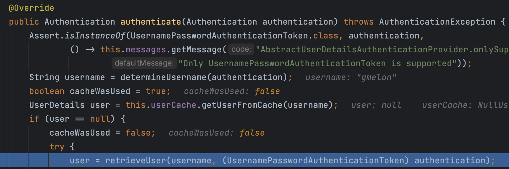

`retrieveUser()`은 `getUserDetailsService().loadUserByUsername()`을 호출하는데 여기서 호출하는 `UserDetailsService`가 바로 우리가 `UserDetailsService`를 `implements` 하여 작성한 코드이다.

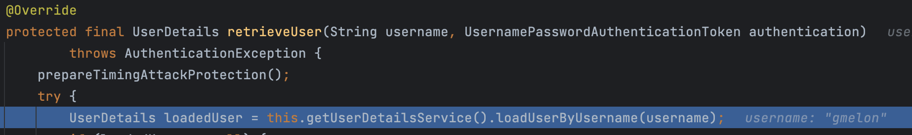

그래서 아래에 우리가 직접 구현한 `AccountService implements UserDetailsService`의 `loadUserByUsername()` 메서드가 호출되어 `UserDetails`를 드디어!!!! 반환한다.

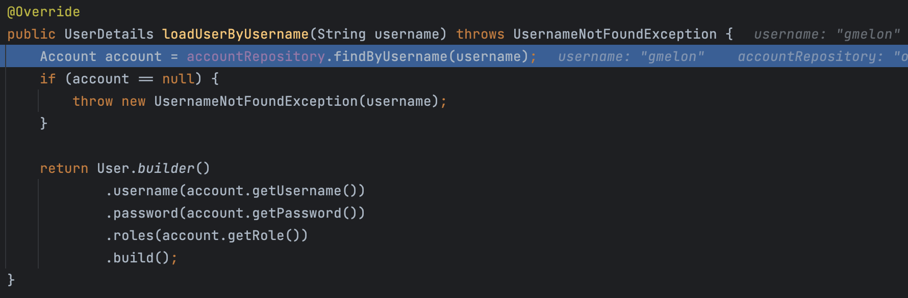

`retrieveUser()` 메서드가 `UserDetails`를  반환하면  이제 본격적으로 인증 로직이 수행된다. 구체적으로는 `DaoAuthenticationProvider`의 `additionalAuthenticationChecks()` 에서 아래와 같이 입력받은 password와 db에서 가져온 password(인코딩 과정 거침)를 비교해 일치 여부를 확인하게 된다.

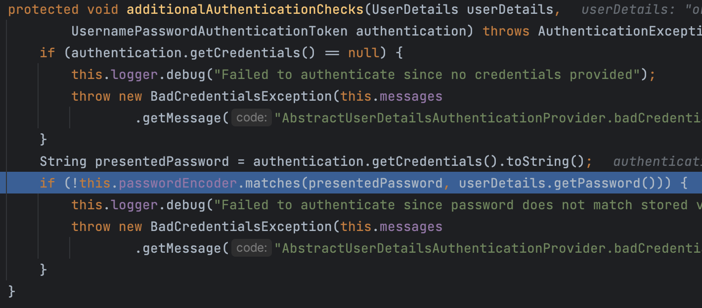

계속해서 기타 나머지 인증 과정을 거쳐 모든 로직이 완료되면 아래와 같이 인증된 정보가 저장된 `Authentication` 객체가 `SecurityContextHolder`에 저장되고, 이 글 제일 처음에 작성되어있던 코드를 사용해 이를 꺼내올 수 있다.

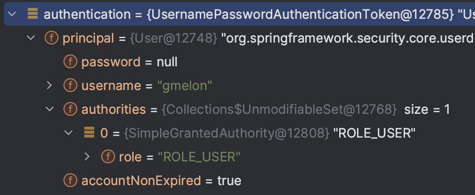

인증 전과는 달리 `Principal`이 단순 `username`을 담은 문자열이 아니라 `User` 객체임을 알 수 있고 `GrantedAuthority` 또한 `ROLE_USER`로 잘 들어가있는 것을 볼 수 있다.

### 인증 아키텍처 이미지

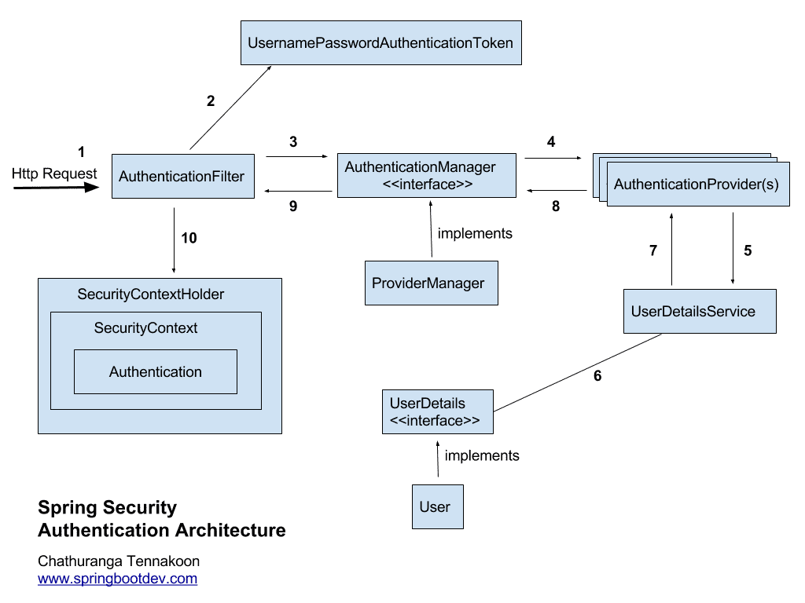

## ThreadLocal

`Java.lang` 패키지에서 제공하는 **쓰레드 범위 변수**. 즉, **쓰레드 레벨**의 **데이터 저장소**. 같은 쓰레드에서 공유되므로 동일한 쓰레드에서 해당 변수에 접근하고자 할 때 메서드에 인자로 건네줄 필요 없이 바로 접근할 수 있음. `SecurityContextHolder`는 `ThreadLocal`를 사용해 `SecurityContext`를 저장하는 것이 기본 전략임.

예제를 만들어보자. 아래와 같이 `Account`를 저장하는 `ThreadLocal`를 static 변수로 갖는 유틸성 클래스를 만든다.

```java
public class AccountContext {
    private static final ThreadLocal<Account> ACCOUNT_THREAD_LOCAL = new ThreadLocal<>();

    public static void setAccount(Account account) {
        ACCOUNT_THREAD_LOCAL.set(account);
    }

    public static Account getAccount() {
        return ACCOUNT_THREAD_LOCAL.get();
    }
}
```

그리고 컨트롤러에서 `Principal` 정보를 통해 레포지토리에서 `Account`를 조회하고 `AccountContext`에 세팅한다.

```java
@GetMapping("/dashboard")
public String dashboard(Model model, Principal principal) {
    AccountContext.setAccount(accountRepository.findByUsername(principal.getName()));
    sampleService.dashboard();
```

이어서 호출되는 `sampleService.dashboard()`는 아래와 같이 로직이 작성되어 있다.

```java
public void dashboard() {
    // ThreadLocal 에서 변수를 가져오는 코드
    // 현재 쓰레드가 어떤 요청을 처리하는지에 따라 값이 달라진다
    Account account = AccountContext.getAccount();

    System.out.println("account.getUsername() = " + account.getUsername());
    System.out.println("account.getRole() = " + account.getRole());
}
```

같은 요청 쓰레드 안에서 `ThreadLocal`을 사용해 `Account` 정보를 set하고 get 했으므로 아래와 같이 account에 대한 정보가 잘 출력되는 것을 확인할 수 있다.

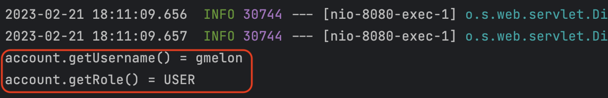

이러한 방식으로 `SecurityContextHolder`도 `SecurityContext`를 저장하고 불러와 사용할 수 있게 해준다.

## Authentication과 SecurityContextHodler

`AuthenticationManager` 가 인증을 마치고 반환한 `Authentication` (`Principal`, `Credentials`, `GrantedAuthorities`) 객체는 누가 어떻게 `SecurityContextHolder`에 넣어주는가? 또, 누가 `AuthenticationManager`에게 **인증을 하라**고 명령하는가??

이에 대한 대답은 `Filter` 들에 있다.

### UsernamePasswordAuthenticationFilter

폼 인증을 처리하는 시큐리티 필터. 아래 코드와 같이 `AuthenticationManager`를 불러와 `authenticate()` 메소드를 호출한다. 앞서 살펴본 인증 과정은 이 필터에서 부터 시작된다.

```java
@Override
public Authentication attemptAuthentication(HttpServletRequest request, HttpServletResponse response) throws AuthenticationException {
    ...
    // authenticate() 호출
	return this.getAuthenticationManager().authenticate(authRequest);
}
```

참고로 `authRequest`는 `HttpServletRequest` 에서 `username`과 `password`로 파라미터를 조회해 얻은 후 생성해 넣어주게 된다. (아래는 코드 일부 - 호출 순서대로 작성)

```java
UsernamePasswordAuthenticationToken authRequest = UsernamePasswordAuthenticationToken.unauthenticated(username, password);

---

String username = obtainUsername(request);

---

protected String obtainUsername(HttpServletRequest request) {
    return request.getParameter(this.usernameParameter);
}

---
    
private String usernameParameter = SPRING_SECURITY_FORM_USERNAME_KEY;

---
    
public static final String SPRING_SECURITY_FORM_USERNAME_KEY = "username";
```

`UsernamePasswordAuthenticationFilter` 는 `AbstractAuthenticationProcessingFilter` 를 상속받고 있으며, `UsernamePasswordAuthenticationFilter.attemptAuthentication()` 메소드는 `AbstractAuthenticationProcessingFilter.doFilter()`에서 호출된다. 따라서 `attemptAuthentication()` 메소드에서 반환된 `Authentication` 객체는 `AbstractAuthenticationProcessingFilter`의 아래 코드를 통해 `SecurityContextHolder`에 들어가게 된다.

```java
SecurityContext context = SecurityContextHolder.createEmptyContext();
context.setAuthentication(authResult);
SecurityContextHolder.setContext(context);
```

모든 과정이 끝나면, 로그인 수행(`/login`) 전 **기존 요청 페이지**로 리다이렉션을 수행한다.

### SecurityContextPersisenceFilter

한 번 로그인 한 후 페이지를 새로고침해보자.

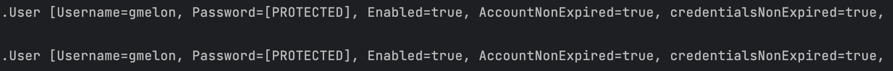

다시 로그인을 해주지 않아도 이전 요청 때와 동일한 `Authentication` 이 유지되는 것을 확인할 수 있다. 이것은 `SecurityContextPersisenceFilter`가 `SecurityContext`를 `HTTP session`에 캐싱(기본 전략)하여 여러 요청에서 동일한 `Authentication`을 공유할 수 있도록 해주기 때문에 가능한 일이다. 

>   `HTTP Session`에서 캐싱된 정보를 가져오는 것은 `HttpSessionSecurityContextRepository` 를 통해 수행된다.

`SecurityContextPersisenceFilter`는 매 요청마다 캐싱해둔 `SecurityContext`를 `SecurityContextHolder`에 복구하려고 시도한다.

```java
// 로그인되어 있지 않으면 contextBeforeChainExecution == null
SecurityContextHolder.setContext(contextBeforeChainExecution);
```

그리고 모든 요청 체인이 끝나면, 아래 코드로 `SecurityContextHolder`를 비워주는 역할도 이 필터가 수행한다.

```java
SecurityContextHolder.clearContext();
```

>   즉, `SecurityContextPersisenceFilter`가 있기 때문에 Stateless 한 HTTP 환경에서도 Stateful 하게 로그인 상태를 유지하는 것이 가능하다.

`SecurityContextRepository`를 교체하면 `HTTP Session`이 아닌 다른 곳에 `Authentication` 객체를 저장하는 것도 가능하다.

## 스프링 시큐리티 필터와 FilterChainProxy

그렇다면, 앞서 살펴본 필터는 또 어디에서 호출되는가?

### FilterChainProxy

`FilterChainProxy`도 `Filter`를 구현하고 있으므로 `doFilter()` 메서드가 존재한다.  아래와 같이 `doFilter()` 메서드에서 `doFilterInternal()` 메서드를 호출하고

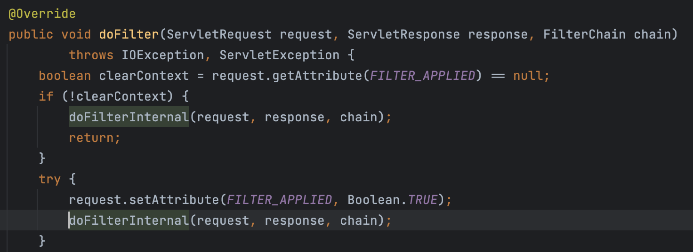

다시 `doFilterInternal()` 메서드에서 `getFilters()` 메서드를 통해 현재 등록된 체인에서 필터들을 가져오는 작업을 한 후


마지막으로 해당 체인의 필터들을 호출하게 된다.

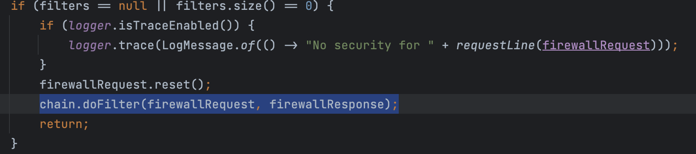

이러한 방식으로 필요한 필터들이 쭉 실행된다. 기본적으로 Form Login과 Http Basic 인증을 사용하는 경우에 체인에 등록되어 실행되는 필터들은 아래와 같다.

1.   WebAsyncManagerIntergrationFilter
2.   **SecurityContextPersistenceFilter**
3.   HeaderWriterFilter
4.   CsrfFilter
5.   LogoutFilter
6.   **UsernamePasswordAuthenticationFilter**
7.   DefaultLoginPageGeneratingFilter
8.   DefaultLogoutPageGeneratingFilter
9.   BasicAuthenticationFilter
10.   RequestCacheAwareFtiler
11.   SecurityContextHolderAwareReqeustFilter
12.   AnonymouseAuthenticationFilter
13.   SessionManagementFilter
14.   ExeptionTranslationFilter
15.   FilterSecurityInterceptor

### SecurityConfig

`SecurityFilterChain` 을 커스텀하는게 사용됨. 하나의 설정이 하나의 `Chain`을 생성한다. 설정에 사용하는 `.antMatcher()` 가 `FilterChainProxy.getFilters()` 에서 요청에 매칭된 체인을 가져오는데 사용됨

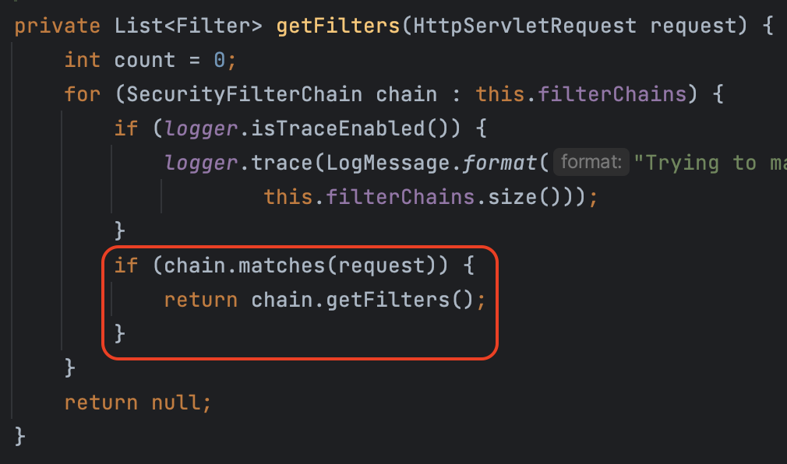

즉, `SecurityConfig`를 여러 개 설정하면 여러 개의 체인이 등록됨 (그 후, 요청에 따라 특정 체인에 매칭)

## DelegatingFilterProxy와 FilterChainProxy

그렇다면!😂 과연 `FilterChainProxy`로는 요청이 어떻게 전달되는가?

### 서블릿 컨테이너

사용자가 서버로 요청을 보내면 서블릿 컨테이너 (ex. Tomcat) 이 그 요청을 받는다. 이러한 컨테이너들은 **서블릿 스펙**을 지원한다. **필터**는 서블릿 스펙에서 명시하고 있는 기능이다. 필터는 간단히 말하면 특정 요청 처리 전 / 후로 특정한 작업을 할 수 있는 인터셉터 역할을 하는 객체이다. 

### DelegatingFilterProxy

자신이 직접 요청에 별다른 처리를 하지 않고 다른 스프링 빈에게 **처리를 위임**한다. 스프링 시큐리티는 `DelegatingFilterProxy` 를 사용해서 `FilterChainProxy`에게 요청 처리를 위임한다고 할 수 있다. `DelegatingFilterProxy` 를 사용할 땐 타겟 빔 이름을 등록해야 하는데 스프링 부트를 사용하면 `SecurityFilterAutoConfiguration` 이 자동으로 `springSecurityFilterChain` 이라는 이름으로 등록을 대신 해준다.

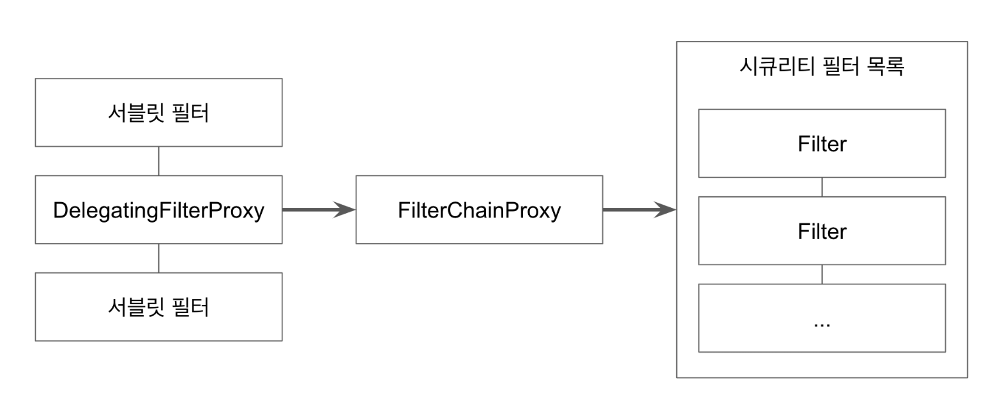

[출처 - [백기선님 인프런 스프링 시큐리티 강의](https://www.inflearn.com/course/%EB%B0%B1%EA%B8%B0%EC%84%A0-%EC%8A%A4%ED%94%84%EB%A7%81-%EC%8B%9C%ED%81%90%EB%A6%AC%ED%8B%B0)]

## AccessDecisionManager

이미 인증을 거친 사용자가 특정 리소스에 접근할 때 그것을 허용(**인가**)할 것인가? 를 결정하는 인터페이스.

>   즉, **인증**을 처리할 땐 `AuthenticationManager`가, **인가**를 처리할 땐 `AccessDecisionManager`가 사용된다

아래와 같이 `decide()` 메서드를 통해 인가 여부를 반환한다.

```java
void decide(Authentication authentication, Object object, Collection<ConfigAttribute> configAttributes) throws AccessDeniedException, InsufficientAuthenticationException;
```

기본 구현체는 3가지가 존재. 몇 개의 `AccessDecisionVoter` 가 동의를 해야 권한을 인정할지에 따라 구현체가 달라진다.

1.   Affirmative(긍정)Based - 기본 전략, 하나의 `Voter` 라도 동의하면 인가
2.   Consensus(합의 - 다수결)Based
3.   Unanimous(만장일치)Based

### AccessDecisionVoter

`Authentication` 객체가 특정 리소스에 접근하는데 필요한 `ConfigAttributes` 를 만족하는지 확인. 아래와 같은 API를 제공한다.

```java
boolean supports(ConfigAttribute attribute);

// 접근이 허용되는지 여부를 반환
// 허용 1
// 모르겠다 0
// 불허 -1
int vote(Authentication authentication, S object, Collection<ConfigAttribute> attributes);
```

구현체는 여러 가지가 있고, 기본 구현체는 `WebExpressionVoter` 이다. 이 `Voter`는 `ROLE_Xxx` 가 일치하는지를 확인하게 된다.

### AccessDecisionManager 구조

앞서 살펴보았듯 `AccessDecisionManager` 의 기본 구현체는 `AffirmativeBased` 이다. `AffirmativeBased`는 내부적으로 `Voter`를 사용한다. `Voter`의 기본 구현체는 `WebExpressionVoter`이다.

그리고, `WebExpressionVoter`는 다시 내부적으로 `DefaultWebSecurityExpressionHandler` 라는 것을 사용하는데, 아래 코드를 통해 여러 가지 인가에 필요한 설정 값들을 여기서 설정하는 것으로 추정할 수 있다.

```java
// DefaultWebSecurityExpressionHandler
private String defaultRolePrefix = "ROLE_";

@Override
protected SecurityExpressionOperations createSecurityExpressionRoot(Authentication authentication, FilterInvocation fi) {
    WebSecurityExpressionRoot root = new WebSecurityExpressionRoot(authentication, fi);
    root.setPermissionEvaluator(getPermissionEvaluator());
    root.setTrustResolver(this.trustResolver);
    root.setRoleHierarchy(getRoleHierarchy());
    root.setDefaultRolePrefix(this.defaultRolePrefix);
    return root;
}
```

`WebExpressionVoter` 는 아래와 같이 핸들러에서 생성한 정보를 토대로 인가를 진행하는 것으로 보인다.

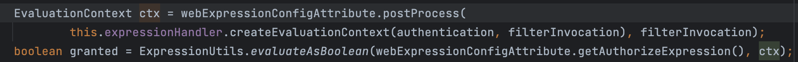

### AccessDecisionManager 커스텀

현재는 `/admin` 페이지의 권한이 아래와 같이 설정되어 있으므로 `ROLE_ADMIN` 권한을 가진 사용자만이 해당 페이지에 접근할 수 있다.

```java
.mvcMatchers("/admin").hasRole("ADMIN")
```

그런데 만약 USER만 접근 가능한 페이지가 아래와 같이 존재한다고 하자.

```java
.mvcMatchers("/user").hasRole("USER")
```

현재 설정대로라면 ADMIN 권한만 가진 사용자는 `/user`에 접근하지 못한다. 하지만 일반적으로 ADMIN 은 USER가 접근 가능한 페이지에도 접근이 가능해야 할 것이다. 이를 가능하게 하기 위해선 여러 가지 방법이 있지만 아래와 같이 위에서 살펴본 `DefaultWebSecurityExpressionHandler`를 커스텀함으로써 가능하게 할 수 있다.

```java
@Configuration
public class SecurityConfig extends WebSecurityConfigurerAdapter {
    public AccessDecisionManager accessDecisionManager() {
        // RoleHierarchyImpl 을 사용해 권한 사이의 계층을 명시할 수 있다.
        RoleHierarchyImpl roleHierarchy = new RoleHierarchyImpl();
        // ADMIN이 USER 보다 상위 계층임을 명시
        roleHierarchy.setHierarchy("ROLE_ADMIN > ROLE_USER");

        DefaultWebSecurityExpressionHandler handler = new DefaultWebSecurityExpressionHandler();
        // 핸들러를 생성해 위에서 만든 RoleHierarchyImpl 정보를 넘겨준다.
        handler.setRoleHierarchy(roleHierarchy);

        WebExpressionVoter webExpressionVoter = new WebExpressionVoter();
        // 위에서 만든 핸들러를 갖는 Voter를 만든다
        webExpressionVoter.setExpressionHandler(handler);

        // 마지막으로, 위에서 만든 Voter를 갖는 AccessDecisionManager의 구현체 AffirmativeBased를 만들어서 반환한다.
        List<AccessDecisionVoter<?>> voters = List.of(webExpressionVoter);
        return new AffirmativeBased(voters);
    }

    @Override
    protected void configure(HttpSecurity http) throws Exception {
        http.authorizeRequests()
                .mvcMatchers("/", "/info", "/account/**").permitAll()
                .mvcMatchers("/admin").hasRole("ADMIN")
                .mvcMatchers("/user").hasRole("USER")
                .anyRequest().authenticated()
            	// accessDecisionManager()에서 반환하는 커스텀된 AccessDecisionManager를 사용하도록 설정
                .accessDecisionManager(accessDecisionManager());
        http.formLogin();
        http.httpBasic();
    }
}
```

## FilterSecurityInterceptor

인가 로직 (`AccessDecisionManager`) 을 호출해주는 필터. 마찬가지로 `FilterChainProxy`에 의해 호출되며 일반적으로 모든 인증 로직을 마친 후에 인가 여부를 판단하기에 보통 가장 마지막에 실행되는 필터이다.

`AbstractSecurityInterceptor` 를 상속받고 있으며, 모든 요청이 들어올 때 마다 이 클래스의 아래 로직이 호출되어 인가 여부를 반환하는 `decide()` 메서드를 호출한다.

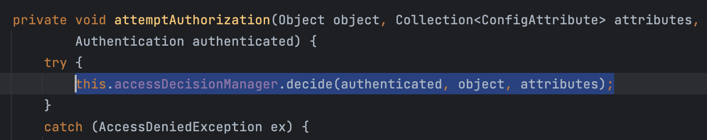

### 로그인을 하지 않았을 때의 동작

#### permitAll() 페이지의 경우

아래와 같이 `ConfigAttribute`가 `permitAll` 이므로 `anonymousUser` 임에도 문제없이 페이지에 접근할 수 있다.

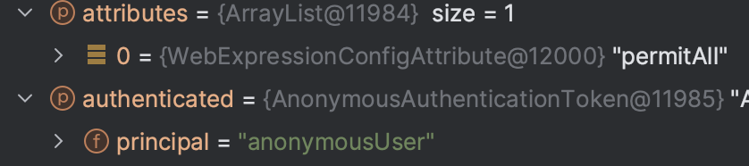

#### 권한이 필요한 페이지의 경우

이 경우, `ConfigAttribute`가 `authenticated`이므로 `anonymousUser` 로는 페이지에 접근할 수 없다.

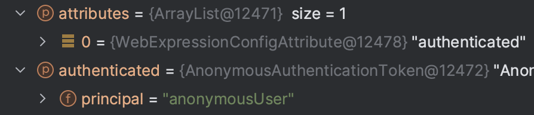

따라서, 아래와 같이 Exception 이 터지고 catch 로직이 수행된다.

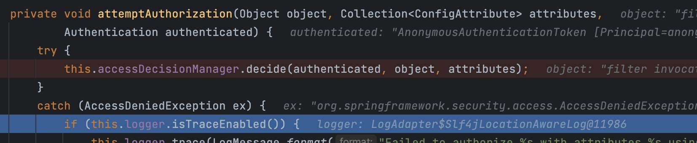

## ExceptionTranslationFilter

앞서 권한이 필요한 페이지에 로그인 하지 않고 접속하면 Exception이 발생하고, 로그인 페이지로 이동하게 된다. 이렇게 인증, 인가 실패 등으로 Exception이 터졌을 때 리다이렉션은 누가 어떻게 처리하는걸까?


## 질문

1.   `ProviderManager` 의 리스트는 누가 들고 있는지, 그들의 `parent`는 누가 주입해주는지?
2.   서블릿 필터 & 체인 작동 방식
3.   필터 vs 인터셉터


## 출처

*   https://www.inflearn.com/course/%EB%B0%B1%EA%B8%B0%EC%84%A0-%EC%8A%A4%ED%94%84%EB%A7%81-%EC%8B%9C%ED%81%90%EB%A6%AC%ED%8B%B0
*   https://gregor77.github.io/2021/04/19/spring-security-01/