## 스프링 시큐리티 ignoring()

아래와 같이 index 페이지에 css를 적용하고 다시 요청을 해보자.

```html
<!DOCTYPE html>
<html lang="en" xmlns:th="http://www.thymeleaf.org">
<head>
    <meta charset="UTF-8">
    <link rel="stylesheet" href="/css/index.css">
    <title>Index</title>
</head>
<body>
    <h1 id="hello" th:text="${message}">Hello</h1>
</body>
</html>
```

```css
#hello {
    font-size: 100px;
}
```

css로 폰트 크기를 변경했음에도 실제로는 반영이 되지 않은 것을 확인할 수 있다.

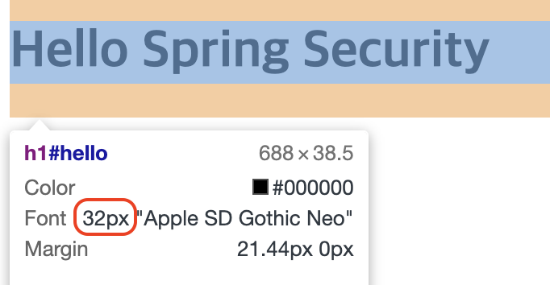

개발자 콘솔로 요청과 응답 상태를 확인해보면, css 파일을 요청하는데 302(리다이렉션) 코드가 뜨고 login 페이지를 추가로 요청한 것을 확인할 수 있다.

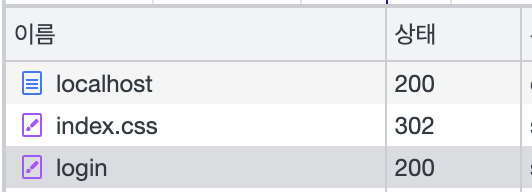

이는 `WebSecurityConfigurerAdapter`를 통해 시큐리티를 설정할 때 지정한 경로 외의 모든 요청은 인증을 받도록 했기 때문에 정적 리소스를 요청하는 경로 또한 인증을 필요로 하게 되었기 때문에 발생하는 문제이다. 이를 해결하기 위해서는 시큐리티 필터가 적용되지 않도록 ignoring 설정을 해주어야 한다.

`@Configuration` 어노테이션으로 지정된 클래스에 아래와 같이 `WebSecurity`를 인자로 받는 메서드를 추가로 재정의해준다.

```java
@Override
public void configure(WebSecurity web) throws Exception {
    web.ignoring().requestMatchers(PathRequest.toStaticResources().atCommonLocations());
}
```

`ignoring().requestMatchers()` 에 `RequestMatcher`를 인자로 넣어주면 해당 경로의 요청은 시큐리티 필터 수행이 무시된다. 스프링 부트에서 제공하는 `PathRequest` 클래스는 손쉽게 일반적인 정적리소스 경로에 대해 `RequestMatcher`를 리스트로 불러와 사용할 수 있도록 메서드를 제공한다. `toStaticResources().atCommonLocation()`는 아래 경로를 `RequestMatcher`로 만들고 리스트로 반환한다.

```java
CSS("/css/**"),
JAVA_SCRIPT("/js/**"),
IMAGES("/images/**"),
WEB_JARS("/webjars/**"),
FAVICON("/favicon.*", "/*/icon-*");
```

ignoring 설정을 추가하고 다시 요청을 보내보면 아래와 같이 css 파일이 리다이렉션 없이 제대로 응답되고 html에 반영도 잘 되는 것을 확인할 수 있다. `ignoring()` 에는 `requestMatchers()`는 물론 `mvcMatchers()` 등 여러 가지 방법으로 자원을 지정하고 해제할 수 있다.

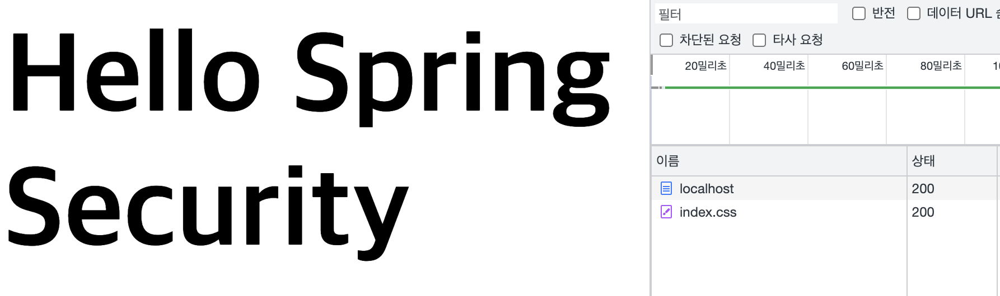

추가로 기존 요청들에 대한 설정과 동일하게 아래와 같이 설정해도 리다이렉션 없이 제대로 css 파일을 불러와 적용할 수 있긴 하지만,

```java
http.authorizeRequests()
    ...
	.requestMatchers(PathRequest.toStaticResources().atCommonLocations()).permitAll()
    ...
```

위와 같이 하게되면 (ignoring을 사용할 때와 달리) 시큐리티 필터를 아예 타지 않는게 아니라 필터를 타되, 마지막 인가 필터 (FilterSecurityInterceptor) 에서 **익명 사용자라도 permitAll() 이므로 허용!** 하고 인가를 해주는 방식이 적용되기 때문에 불필요하게 요청에 많은 리소스가 사용된다.

따라서 아예 시큐리티를 적용하지 않을 자원이라면 `ignoring()`을 사용하는게 효율적이라고 할 수 있다.

## WebAsyncManagerIntegrationFilter

`WebAsyncManagerIntegrationFilter` 는 시큐리티 필터 중 가장 먼저 실행되는 필터로 스프링 MVC의 Async 기능을 사용할 때도 (다른 Thread에서도) SecurityContext를 공유하도록 도와준다.

아래와 같이 컨트롤러에서 `Callable`을 반환할 수 있는데, 이때 `Callable` 의 로직은 별도 쓰레드에서 실행된다. `SecurityContext`는 ThreadLocal에 저장되기 때문에 원래대로라면 공유되지 않아야 하지만, WebAsyncManagerIntegrationFilter 가 pre/postProcess를 통해 SecurityContext를 설정/해제해줌으로써 최초 요청 쓰레드와 별개의 쓰레드에서도 SecurityContext의 참조가 가능해진다.

```java
@GetMapping("/async")
@ResponseBody
public Callable<String> async() {
    // 최초 요청 쓰레드
    System.out.println("MVC");
    System.out.println(SecurityContextHolder.getContext().getAuthentication());
    return () -> {
        // 별도 쓰레드
        System.out.println("Callable");
        System.out.println(SecurityContextHolder.getContext().getAuthentication());
        return "ok";
    };
}
```

접속해보면 아래처럼 동일한 Authentication이 조회되는걸 확인할 수 있다.

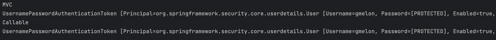

## HeaderWriterFilter

응답 헤더에 시큐리티 관련 헤더를 추가해주는 필터이다. 아래와 같이 보안을 위한 헤더들을 추가해준다. 각 헤더 별로 간단하게 아래와 같은 의미가 있다.

*   Cache-Control, Expires, Pragma : 캐시 히스토리 취약점 방어
*   X-Content-Type-Options : 마임 타입 스니핑 방어
*   X-Frame-Options : clickjacking 방어
*   X-XSS-Protection : 브라우저에 적용된 XSS 필터를 적용해줌

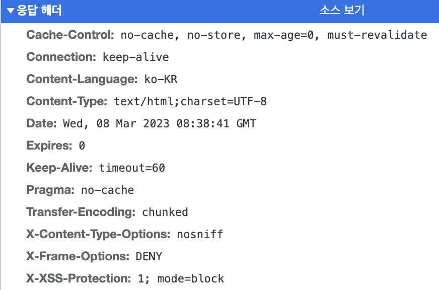

## CsrfFilter

CSRF 어택을 방지해주는 필터.

>   CSRF(Cross-Site Request Forgery) : 공격자 사이트에서 사용자의 의지와 무관하게 악의적인 요청을 만들어서 특정 웹페이지에 전송하는 공격. 원치않는 데이터의 변경이 발생할 수 있다.

### SOP

Same-Origin Policy(동일 출처 정책)으로 동일한 출처 사이에서만 요청을 주고받을 수 있다는 원칙이다. 기본적으로 요청이 동일 출처로 보내지지 않으면 브라우저 수준에서 막아준다.

### CORS

하지만, 다른 서버로의 API 호출 등 출처가 다른 서버끼리의 통신 필요성이 높아짐에따라 이를 허용해야할 일이 생겼고, 이 방법을 명세해놓은 것이 바로 CORS이다. `Access-Control-Allow-Origin` 헤더에 허용할 출처(프로토콜, 도메인, 포트) 를 적어둠으로써 해당 출처를 허용할 수 있고 와일드카드 (`*`)를 적어 모든 출처를 허용할 수 도 있다.

### CSRF

바로 위의 CORS를 사용할 때 CSRF 가 발생할 수 있다.

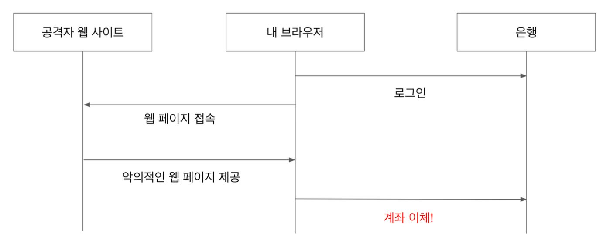

[출처 - 백기선님 인프런 스프링 시큐리티 강의]

스프링 시큐리티는 CsrfFilter를 통해 **CSRF 토큰**을 발행하고 hidden 속성으로 html form에 뿌려준다. 그리고 폼 요청이 올 때 이전에 발행한 토큰과 값이 일치할 때만 요청을 정상적으로 처리하도록 구현되어 있다.

디버깅을 통해 확인해보면, 아래와 같이 CsrfFilter에서 토큰이 생성되고

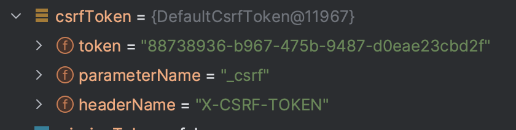

login 페이지 form에 hidden 속성으로 해당 토큰이 들어온 것을 볼 수 있다.

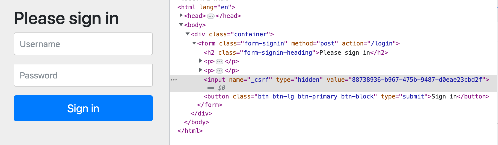

이 상태에서 로그인을 수행하면 정상적으로 로그인이 된다. 만약, 토큰을 임의로 조작해서 요청을 보낸다면 정상적인 계정정보를 입력해도 오류가 발생하여 내부 예외 처리 로직을 타게되고 아래와 같이 다시 로그인 페이지로 리다이렉션된다.

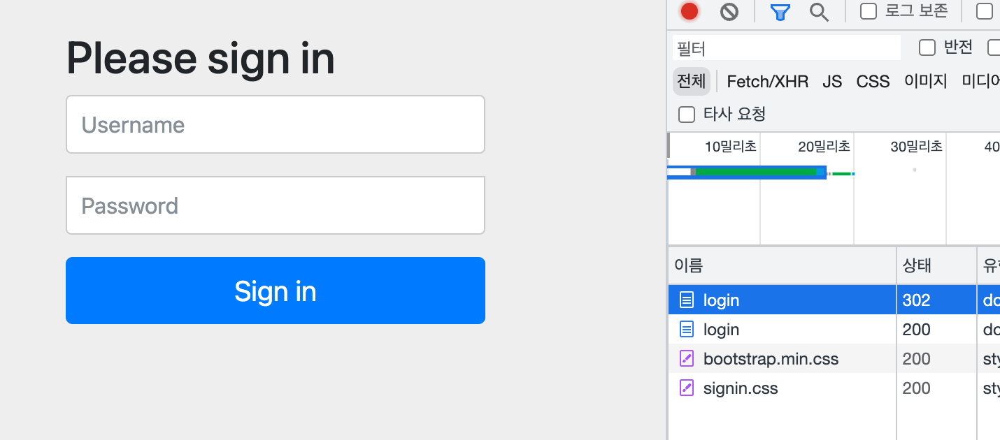

@Configuration에서 `http.csrf().disable()` 로 Csrf 필터를 사용하지 않도록 설정할 수도 있다.

## CSRF 토큰 사용 예제

### 타임리프와의 연동

2.1+ 버전의 타임리프를 사용해 form 태그를 등록하면 자동으로 hidden 속성에 `_csrf` 이름으로 CSRF 토큰을 넣어준다. 따라서 개발자는 별도로 이를 구현하지 않아도 된다.

#### 회원 가입을 위한 signup.html 코드

```html
<!DOCTYPE html>
<html lang="en" xmlns:th="http://www.thymeleaf.org">
<head>
    <meta charset="UTF-8">
    <title>SignUp</title>
</head>
<body>
    <form action="/signup" th:action="@{/signup}" th:object="${account}" method="post">
        <p>Username: <input type="text" th:field="*{username}" /></p>
        <p>Password: <input type="text" th:field="*{password}" /></p>
        <p><input type="submit" value="SignUp" /> </p>
    </form>
</body>
</html>
```

#### 실제 접속 시 반환되는 html

```html
<!DOCTYPE html>
<html lang="en">
<head>
    <meta charset="UTF-8">
    <title>SignUp</title>
</head>
<body>
    <form action="/signup" method="post">
        <input type="hidden" name="_csrf" value="db556c8f-141c-406e-92f7-f27835de2c28"/>
        <p>Username: <input type="text" id="username" name="username" value="" /></p>
        <p>Password: <input type="text" id="password" name="password" value="" /></p>
        <p><input type="submit" value="SignUp" /> </p>
    </form>
</body>
</html>
```

### CSRF 토큰이 없거나 일치하지 않는 경우

postman으로 토큰 없이 form을 post 요청으로 보내보자. 아래 이미지와 같이 인증되지 않아 요청이 처리되지 않는 것을 확인할 수 있다.

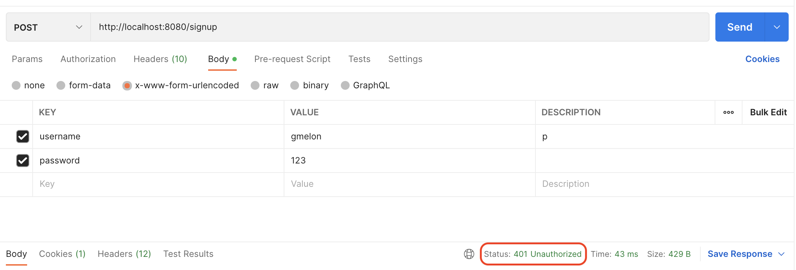

추가로, csrf 토큰을 사용해 테스트 코드를 작성하고자 하는 경우 아래와 같이 MockMvc를 사용하고, `.with(csrf())`를 사용하면 시큐리티에서 적절하게 필요한 CSRF 토큰을 넣어서 요청을 보내준다.

```java
@Test
void 회원가입_테스트_csrf토큰() throws Exception {
    mockMvc.perform(post("/signup")
                    .param("username", "gmelon")
                    .param("password", "123")
                    .with(csrf()))
            .andExpect(status().is3xxRedirection());
}
```

## LogoutFilter

로그아웃에 필요한 처리를 해주는 필터로, 크게 1. `LogoutHandler`를 사용해 로그아웃 과정 중에 필요한 처리를 하고, 2. `LogoutSuccessHandler` 을 사용해 로그아웃 성공 후 필요한 처리를 수행한다.

```java
private void doFilter(HttpServletRequest request, HttpServletResponse response, FilterChain chain) throws IOException, ServletException {
    // 요청이 로그아웃 요청일 때만 필터가 작동하도록 되어있다
    if (requiresLogout(request, response)) {
        Authentication auth = SecurityContextHolder.getContext().getAuthentication();
        if (this.logger.isDebugEnabled()) {
            this.logger.debug(LogMessage.format("Logging out [%s]", auth));
        }
        // 먼저 logout handler가 수행되고
        this.handler.logout(request, response, auth);
        // 로그아웃이 완료되면 logout success handler가 수행된다.
        this.logoutSuccessHandler.onLogoutSuccess(request, response, auth);
        return;
    }
    chain.doFilter(request, response);
}
```

LogoutHandler는 CompositeLogoutHandler가 구현체로 사용되는데 아래와 같이 내부적으로 다시 LogoutHandler의 리스트를 갖기 때문에 여러 개의 LogoutHandler가 연달아서 수행된다고 생각하면 된다.

```java
public final class CompositeLogoutHandler implements LogoutHandler {
	private final List<LogoutHandler> logoutHandlers;
    
    ...
        
    @Override
	public void logout(HttpServletRequest request, HttpServletResponse response, Authentication authentication) {
		for (LogoutHandler handler : this.logoutHandlers) {
			handler.logout(request, response, authentication);
		}
	}
}
```

기본적으로 LogoutHandler로 아래 핸들러들이 사용되고,

*   CsrfLogoutHandler
*   SecurityContextLogoutHandler

LogoutSuccessHandler의 기본 구현체는 SimpleUrlLogoutSuccessHandler이다.

아래 코드를 통해 LogoutFilter의 여러 설정들을 커스텀할 수 있다.

```java
http.logout()
    .logoutUrl("/logout")
    .logoutSuccessUrl("/")
    .logoutRequestMatcher()
    .invalidateHttpSession(true)
    .deleteCookies()
    .addLogoutHandler()
    .logoutSuccessHandler();
```

이때 `logout().logoutUrl()`을 통한 로그아웃 주소 수정은 DefaultLogoutPageGeneratingFilter에서 기본으로 생성되는 로그아웃 폼의 `action` 주소를 수정하는게 아니라 **어떤 주소로 요청이 들어왔을 때 LogoutFilter가 작동하도록 할지 설정하는 것**임에 유의하자.

## DefaultLogin/LogoutPageGeneratingFilter

기본 로그인 / 로그아웃 폼 페이지를 생성해주는 필터로 /login, /logout url로의 GET 요청을 처리해준다.

@Configuration에서 아래 코드를 통해 폼 태그의 id를 변경할 수 있다.

```java
http.formLogin()
    .usernameParameter("my-username")
    .passwordParameter("my-password");
```

아래 코드를 적용하면 해당 url의 (개발자가 직접 개발한) 페이지가 로그인 / 로그아웃에 사용되는 것으로 간주하여 DefaultLogin/LogoutPageGeneratingFilter가 등록되지 않는다.

```java
http.formLogin()
    .loginPage("/signin")
    .permitAll();
```

>   로그인 / 로그아웃 페이지 중 하나만 변경해도 로그인 / 로그아웃 페이지 생성 필터 두 개가 모두 적용되지 않는다. 즉, 하나라도 커스텀하고 싶다면 로그인 / 로그아웃 페이지를 모두 커스텀해야 한다.

## 로그인/로그아웃 폼 커스터마이징

아래 코드로 기본 로그인 페이지를 바꾸면, 

1.   DefaultLogin/LogoutPageGeneratingFilter가 등록되지 않는다. 따라서 직접 로그인/로그아웃 페이지, 컨트롤러 등을 등록해야 한다.
2.   UsernamePasswordAuthenticationFilter가 로그인을 처리해주는 POST url로 아래 코드에 작성된 url로 변경된다. 즉, 아래의 경우 직접 만든 GET /signin 로그인 페이지에서 /signin에 POST로 username, password 값을 날려주면 UsernamePasswordAuthenticationFilter가 로그인 처리를 해주게 된다.

```java
http.formLogin()
    .loginPage("/signin")
    .permitAll();
```

>   로그아웃처리를 위한 POST url은 위에서 살펴본 것 처럼 http.logout().logoutURL(url)로 변경할 수 있다. 기본 값은 /logout.

#### 설정 변경

```java
http.formLogin()
        .loginPage("/signin")
        .permitAll();

http.logout()
        .logoutUrl("/signout")
        .logoutSuccessUrl("/");
```

#### 컨트롤러 (GET만 설정 필요)

```java
@Controller
public class LogInOutController {

    @GetMapping("/signin")
    public String signinForm() {
        return "signin";
    }

    @GetMapping("/signout")
    public String signoutForm() {
        return "signout";
    }
}
```

#### Signin.html

```html
<!DOCTYPE html>
<html lang="en" xmlns:th="http://www.thymeleaf.org">
<head>
    <meta charset="UTF-8">
    <title>Login</title>
</head>
<body>
    <h1>Login</h1>
    <!-- /signin 으로 로그인 요청 POST -->
    <!-- UsernamePasswordAuthenticationFilter가 처리 -->
    <form th:action="@{/signin}" method="post">
        <p>Username : <Input type="text" th:name="username"/></p>
        <p>Password : <Input type="password" th:name="password"/></p>
        <p><input type="submit" value="Login"/></p>
    </form>
</body>
</html>
```

#### Signout.html

```html
<!DOCTYPE html>
<html lang="en">
<head>
    <meta charset="UTF-8">
    <title>Logout</title>
</head>
<body>
  <!-- /signout 으로 로그아웃 요청 POST -->
  <!-- LogoutFilter가 처리 -->
  <form th:action="@{/signout}" method="post">
    <p><input type="submit" value="Logout"/></p>
  </form>
</body>
</html>
```

#### 로그인 / 로그아웃 테스트

먼저 로그인을 하지 않고 인증을 필요로 하는 페이지인 /dashboard로 접근한다.

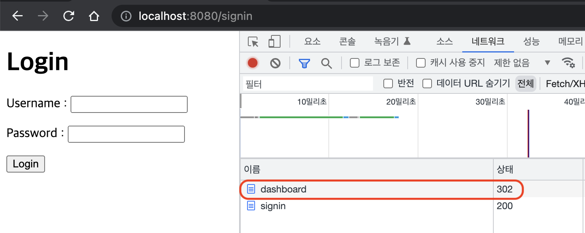

그럼 변경된 로그인 url인 /signin으로 리다이렉션이 발생한다. 그럼 앞서 작성한 컨트롤러에 의해 직접 만든 로그인 페이지로 이동하게 된다. 여기서 정상적으로 로그인을 수행하면 다시 /signin 으로 POST 요청이 발생하고 아래와 같이 로그인에 성공해 다시 /dashboard로 리다이렉션된다.

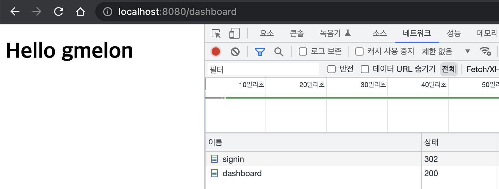

이제 로그아웃을 해보자. 컨트롤러에 의해 접근가능한 /signout 에서 아래 버튼을 클릭하면 /signout 으로 POST 요청이 발생한다.

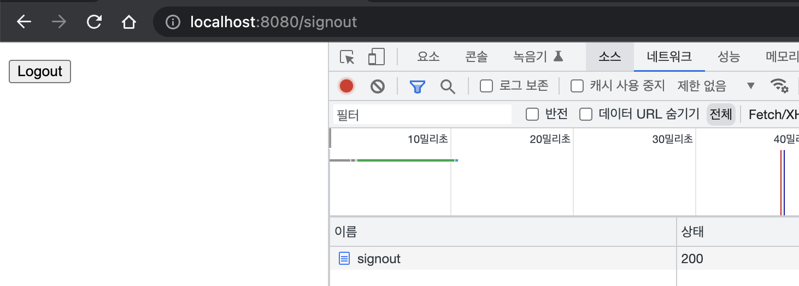

그 후 정상적으로 로그아웃이 되는 것을 확인할 수 있다.

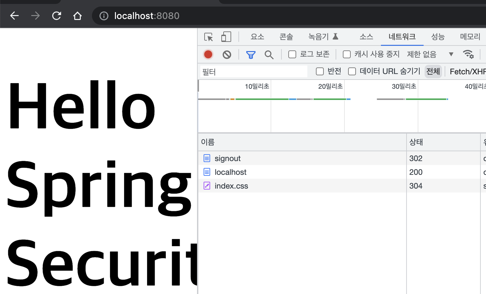

## BasicAuthenticationFilter

시큐리티 설정에서 `http.httpBasic()`을 설정했기 때문에 활성화되는 필터. 매 요청마다 헤더에 `username:password`를 BASE64로 인코딩하여 보내면 인증을 처리하는 방식. 당연히 보안에 매우 취약하므로 https를 사용해야 한다. 

아래와 같이 curl을 사용해 테스트해볼 수 있다.

```bash
❯ curl -u gmelon:123 http://localhost:8080/dashboard
<!DOCTYPE html>
<html lang="en">
<head>
    <meta charset="UTF-8">
    <title>Dashboard</title>
</head>
<body>
    <h1>Hello gmelon</h1>
</body>
</html>%
```

```bash
❯ curl -v http://localhost:8080/dashboard # 인증 정보 없이 호출
*   Trying 127.0.0.1:8080...
(생략)
< HTTP/1.1 401 # 401 Unauthorized Error 발생
< Set-Cookie: JSESSIONID=141CD5AD08920AE8DE6E903529A81157; Path=/; HttpOnly
(생략)
```

## RequestCacheAwareFilter

현재 요청과 관련 있는 **캐시된 요청**이 있는지 찾아서 적용하는 필터로 캐시된 요청이 있다면 해당 요청을 처리하고, 없다면 현재 요청을 처리한다.

로그인을 하지 않고 인증이 필요한 페이지에 접근할 때 로그인 페이지로 리다이렉션된 후, 로그인 성공 시 다시 기존 방문하려 했던 페이지로 접근하게 되는데 이때 최초의 요청이 캐시되었다가 불러와져서 이러한 동작이 가능하게 된다.

## AnonymousAuthenticationFilter

현재 SecurityContext에 Authentication이 null이면 익명 Authentication을 만들어서 넣어준다. 아니면, 아무일도 하지 않는다. 일종의 **null object pattern**이라고 할 수 있다. (진짜 null이 아닌 null을 대변하는 객체를 사용해 식별하도록 하는 것을 말함)

## SessionManagementFilter

세션 관련 보안 및 기타 관리를 해주는 필터. 크게 아래와 같은 기능을 제공한다.

*   세션 변조 방지 전략 설정 : sessionFixation()
    *   로그인 시 어떤 방식으로 세션 변조를 방지할지 선택할 수 있음
    *   none
    *   newSession
    *   migrateSession (서블릿 3.0.x 이하에서 기본값)
    *   changeSessionId (서블릿 3.1.x 이상에서 기본값)
*   유효하지 않은 세션을 리다이렉트 시킬 URL 설정 : invalidSessionUrl()
*   동시성 제어 : maximumSessions()
    *   동시에 몇 개의 로그인을 허용할지 설정할 수 있다
    *   기본 값은 동시 로그인을 막지 않음
*   세션 생성 전략 : sessionCreationPolicy
    *   IF_REQUIRED : **기본 값**, 필요할 경우에만 생성
    *   NEVER : 세션을 굳이 생성하진 않으나, 있으면 사용함
    *   STATELESS : 세션이 있어도 절대 사용하지 X
    *   ALWAYS : 항상 생성

위 설정들은 아래와 같이 사용할 수 있다.

```java
http.sessionManagement()
        .sessionCreationPolicy(SessionCreationPolicy.IF_REQUIRED)
        .maximumSessions(3);
```

## ExceptionTranslationFilter

인증, 인가에서 발생하는 에러 처리를 담당하는 필터. ExceptionTranslationFilter가 `FilterSecurityInterceptor`를 감싸고 (try-catch) FilterSecurityInterceptor에서 발생하는 예외들을 처리하게 된다.

### 발생 예외들

먼저 **인증**이 되지 않은 경우 즉, 로그인하지 않은 상태로 로그인이 필요한 사이트에 접속하는 경우 AuthenticationException이 발생하며 이때 AuthenticationEntryPoint(인터페이스)를 통해 예외처리를 하게 된다. AuthenticationEntryPoint는 인터페이스로 form 인증에서 기본 구현체는 LoginUrlAuthenticationEntryPoint로 로그인 페이지로 리다이렉션해준다.

만약 **인가**가 되지 않은 경우 AxxessDeniedException이 발생하며 AccessDeniedHandler에 의해 예외처리가 된다. AccessDeniedHandler의 기본 구현체는 AccessDeniedHandlerImpl로 403(forbidden) 오류코드를 내려주고 시큐리티에서 제공하는 기본 오류 페이지를 표시해준다.

### 오류 페이지 커스텀

시큐리티에서 제공하는 기본 오류 페이지를 커스텀하려면 먼저 아래와 같이 url을 설정하고,

```java
http.exceptionHandling()
        .accessDeniedPage("/access-denied");
```

아래와 같이 오류 페이지를 커스텀하고 컨트롤러를 만들면 된다.

#### access-denied.html

```html
<!DOCTYPE html>
<html lang="en" xmlns:th="http://www.thymeleaf.org">
<head>
    <meta charset="UTF-8">
    <link rel="stylesheet" href="/css/index.css">
    <title>Access Denied</title>
</head>
<body>
    <h1><span th:text="${name}">Name</span>, you are not allowed to access to the page.</h1>
</body>
</html>
```

#### 컨트롤러

```java
@Controller
public class AccessDeniedController {
    @GetMapping("/access-denied")
    public String accessDenied(Principal principal, Model model) {
        model.addAttribute("name", principal.getName());
        return "access-denied";
    }
}
```

그런데 이렇게까지만 하면, 서버측에서는 계속해서 잘못된 인가 요청이 들어와도 알아차리지 못한다. 서버에 로깅을 해주기 위해선 단순히 `accessDeniedPage()`만 변경할 것이 아니라 아예 accessDeniedHandler를 커스텀해서 사용하자. (커스텀한 AccessDeniedHandler을 별도의 클래스로 분리해 빈으로 등록하고 불러와 사용하는 등의 방법이 더 바람직)

```java
http.exceptionHandling()
        .accessDeniedHandler((request, response, accessDeniedException) -> {
            UserDetails principal = (UserDetails) SecurityContextHolder.getContext().getAuthentication().getPrincipal();
            String username = principal.getUsername();
            String servletPath = request.getServletPath();
            log.info("{} is denied to access to {}", username, servletPath);
            response.sendRedirect("/access-denied");
        });
```

그럼 아래와 같이 `ROLE_USER` 인 gmelon이 `ROLE_ADMIN` 만 접근가능한 /admin 에 요청을 보냈을 때 커스텀된 오류 페이지가 출력되고, 서버에서 로그를 남길 수 있다.

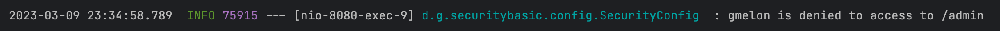


## FilterSecurityInterceptor

AccessDecisionManager(인터페이스)를 호출해서 인가 로직을 수행해주는 필터. @Configuration에서 설정했던 아래와 같은 정보들을 토대로 인증, 인가 로직을 처리한다.

```java
http.authorizeRequests()
        .mvcMatchers("/", "/info", "/account/**", "/signup", "/h2-console/**").permitAll()
        .mvcMatchers("/admin").hasRole("ADMIN")
        .mvcMatchers("/user").hasRole("USER")
        .anyRequest().authenticated()
        .accessDecisionManager(accessDecisionManager());
```

*   mvcMatchers() - ant 패턴을 지원하므로 유용하게 사용될 수 있음
*   hasRole() - prefix `ROLE_`을 생략하고 권한 입력 가능
*   hasAuthority() - prefix를 포함해 입력할 수도 있다
*   rememberMe() - 토큰 방식으로 인증 (다음 장에서 다룸)
*   fullyAuthenticated() - rememberMe 토큰방식으로 인증을 하고 있을 때 이 설정이 지정된 url은 다시 한 번 인증을 요구함

## RememberMeAuthenticationFilter


## 출처

*   백기선님 인프런 스프링 시큐리티 강의
*   https://hudi.blog/sop-and-cors/
